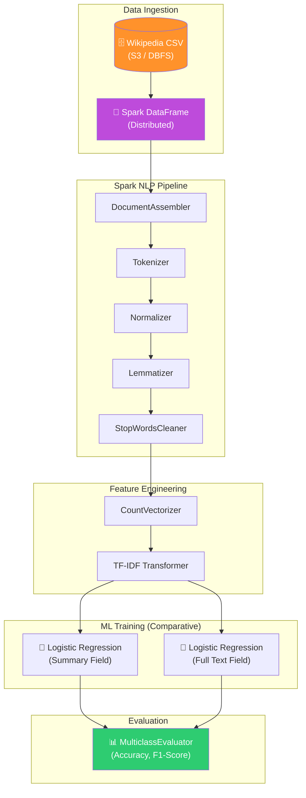
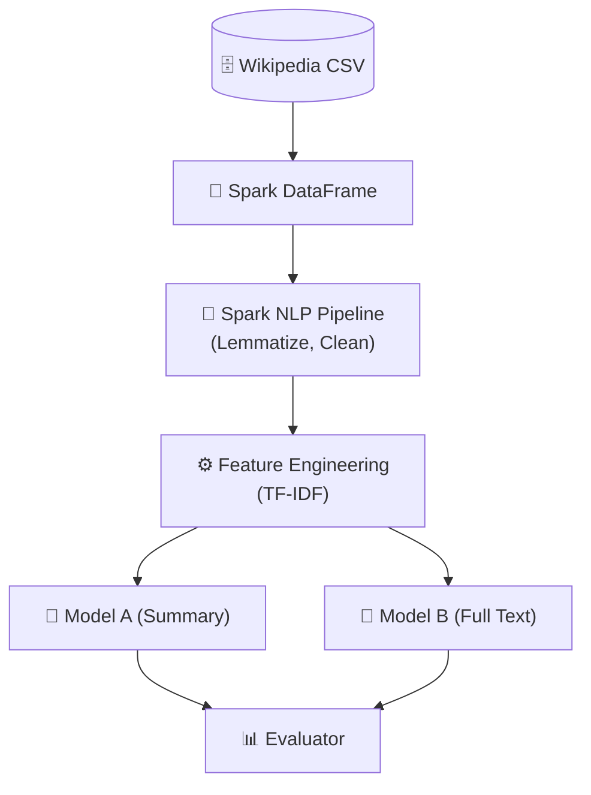

# 📚 WikiClassifier: Enterprise Big Data Analysis & Distributed NLP

<p align="center">
  
  
  
  
  
</p>

**WikiClassifier** è un'infrastruttura di analisi e classificazione distribuita progettata per gestire dataset testuali massivi. Utilizzando **Apache Spark** su piattaforma **Databricks**, il progetto implementa una pipeline di Content Intelligence che trasforma dati non strutturati (articoli Wikipedia) in insight categorizzati, confrontando l'efficacia predittiva di diversi segmenti testuali su scala distribuita.

## 🏢 Valore Enterprise & Settori di Applicazione

| Settore / Ambito | Rilevanza & Benefici |
|-------------------|-----------|
| **Content & Knowledge Management** | Automazione della tassonomia per grandi repository documentali, editoria digitale e basi di conoscenza aziendali. |
| **Media Intelligence** | Monitoraggio in tempo reale di news e social media tramite classificazione multi-classe accelerata da hardware distribuito. |
| **Customer Experience** | Sentiment analysis e categorizzazione automatica dei feedback clienti su larga scala per il supporto decisionale. |
| **Legal & Compliance Tech** | Classificazione automatica di documenti legali o contratti per facilitare la ricerca semantica e l'audit. |

---

## 🎯 Executive Summary & Valore di Business
WikiClassifier affronta la sfida della categorizzazione automatica di milioni di documenti dove le architetture a nodo singolo fallirebbero per limiti di memoria e tempo di calcolo.

### 🏛️ 1. Distributed NLP Pipeline (Spark NLP)
* **Preprocessing Scalabile:** Invece di librerie locali (come NLTK o Spacy), il progetto utilizza **Spark NLP** per eseguire normalizzazione, lemmatizzazione e rimozione delle stopword in parallelo su tutti i nodi del cluster.
* **Feature Engineering Distribuita:** Implementazione di `CountVectorizer` e `HashingTF` per la creazione di vettori TF-IDF distribuiti, ottimizzando l'uso del partizionamento Spark per ridurre lo shuffling dei dati.

### 🤖 2. Advanced Machine Learning (MLlib)
* **Comparative Modeling:** Il progetto addestra e confronta due classificatori `Logistic Regression` indipendenti. Uno focalizzato sul campo `summary` (segnale denso) e uno sul corpo completo `documents` (segnale rumoroso ma ricco), identificando il miglior compromesso tra accuratezza e velocità di training.
* **Valutazione Rigorosa:** Utilizzo del `MulticlassClassificationEvaluator` per estrarre metriche di Accuracy e F1-Score, garantendo la robustezza statistica del modello finale.

### ⚙️ 3. Big Data Best Practices
* **Lazy Evaluation & Caching:** Ottimizzazione del piano di esecuzione Spark tramite l'uso strategico di `cache()` e `persist()` sui DataFrame intermedi per accelerare le iterazioni del modello ML.
* **Schema Enforcement:** Definizione rigorosa degli schemi durante l'ingestion per garantire la consistenza dei dati attraverso l'intero grafo di computazione.

---

## 🏗️ Architettura della Pipeline



## 🛠️ Stack Tecnologico

| Layer | Tecnologia | Ruolo |
|:------|:-----------|:-----|
| 🚀 **Engine** | Apache Spark 3.x | Distributed Computing Framework |
| ☁️ **Platform** | Databricks | Unified Analytics Platform |
| 🧪 **NLP** | Spark NLP | Production-grade NLP on Spark |
| 🤖 **ML** | PySpark MLlib | Scalable Machine Learning Library |
| 🐼 **Ops** | pandas / NumPy | Local evaluation and plotting |

## 🚀 Setup (Databricks)

Per riprodurre il progetto su un cluster Databricks:

1. **Configurazione Cluster:** Utilizzare una runtime Databricks che includa Spark 3.x.
2. **Installazione Librerie:** Aggiungere `spark-nlp` tramite Maven/PyPI.
3. **Ingestion Dati:**
   ```python
   # Caricamento del dataset
   !wget https://proai-datasets.s3.eu-west-3.amazonaws.com/wikipedia.csv
   import pandas as pd
   dataset = pd.read_csv('/databricks/driver/wikipedia.csv')
   spark_df = spark.createDataFrame(dataset).drop("Unnamed: 0")
   spark_df.write.saveAsTable("wikipedia")
   ```
4. **Esecuzione:** Eseguire i notebook nella cartella `notebooks/` rispettando l'ordine (EDA → Model Training).

<br><br>

*Progettato e sviluppato da Eugenio Pasqua.*

---

# 🇬🇧 ENGLISH VERSION

# 📚 WikiClassifier: Enterprise Big Data Analysis & Distributed NLP

<p align="center">
  
  
  
  
</p>

**WikiClassifier** is a distributed analysis and classification infrastructure designed to handle massive textual datasets. Using **Apache Spark** on the **Databricks** platform, the project implements a Content Intelligence pipeline that transforms unstructured data (Wikipedia articles) into categorized insights, comparing the predictive effectiveness of different textual segments at a distributed scale.

## 🏢 Enterprise Value & Application Sectors

| Sector / Domain | Relevance & Benefits |
|-------------------|-----------|
| **Content & Knowledge Management** | Taxonomy automation for large document repositories and corporate knowledge bases. |
| **Media Intelligence** | Real-time news and social media monitoring via multi-class classification accelerated by distributed hardware. |
| **Customer Experience** | Sentiment analysis and automated categorization of customer feedback at scale for decision support. |
| **Legal & Compliance Tech** | Automated classification of legal documents or contracts to facilitate semantic search and auditing. |

---

## 🎯 Executive Summary & Business Value
WikiClassifier addresses the challenge of automatically categorizing millions of documents where single-node architectures would fail due to memory and compute time limits.

### 🏛️ 1. Distributed NLP Pipeline (Spark NLP)
* **Scalable Preprocessing:** Instead of local libraries (like NLTK or Spacy), the project uses **Spark NLP** to perform normalization, lemmatization, and stopword removal in parallel across all cluster nodes.
* **Distributed Feature Engineering:** Implementation of `CountVectorizer` and `HashingTF` for creating distributed TF-IDF vectors, optimizing Spark partitioning to reduce data shuffling.

### 🤖 2. Advanced Machine Learning (MLlib)
* **Comparative Modeling:** The project trains and compares two independent `Logistic Regression` classifiers. One focused on the `summary` field (dense signal) and one on the full `documents` body (noisy but rich signal), identifying the best trade-off between accuracy and training speed.

---

## 🏗️ Pipeline Architecture



## 🧰 Technology Stack

`PySpark 3.x` · `Databricks` · `Spark NLP` · `PySpark MLlib` · `LogisticRegression` · `MulticlassClassificationEvaluator`

<br><br>

*Designed and developed by Eugenio Pasqua.*
